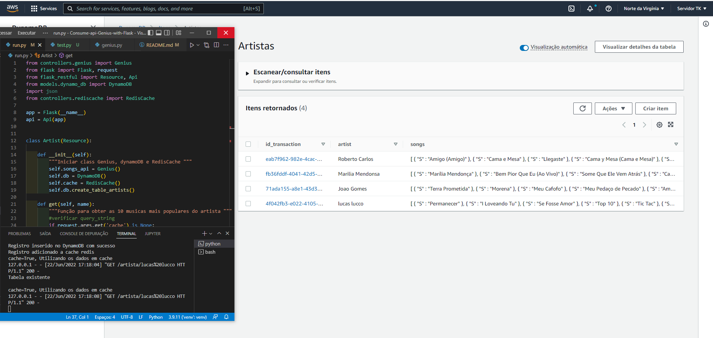

# CONSUMIR API GENIUS COM PYTHON(FLASK)

**Obs: No arquvio `exemplo.env` remover o exemplo e deixar somente o `.env` e adcionar as informações do Genius e AWS**

*Links abaixo para criar conta e pegar as informações necessárias GENUIS = (GENIUS_TOKEN) | AWS (AWS_ACCESS_KEY_ID, AWS_SECRET_ACCESS_KEY)*

- [Criar conta Genuis (Grátis) - Clique aqui](https://docs.genius.com/#/getting-started-h1)
- [Conta AWS DynamoDB (Grátis) - Clique aqui](https://aws.amazon.com/pt/free/?all-free-tier.sort-by=item.additionalFields.SortRank&all-free-tier.sort-order=asc)

## Instalar criar e ativar ambiente virtual
~~~ shell
pip install virtualenv
~~~
~~~ shell
python -m venv venv
~~~
~~~ shell
venv/scripts/activate
~~~

## Instalar Bibliotecas
~~~ shell
pip install -r requirements.txt
~~~

## Instalar Cache Redis no windows
**Instalar o executavel `Redis-x64-3.0.504.msi` que está dentro da pasta files e seguir com passo a passo abaixo.**
*Se utiliza outro sistema operacional, o link dos arquivos necessarios + informações: [Clique aqui para mais informações](https://github.com/microsoftarchive/redis*)

## Rodar aplicação e informações
**No arquivo `teste.env` voce deve alterar-lo para `.env` e colocar as dependências dentro.**
- `Criar Token no Genius e adcionar na parte GENIUS_TOKEN=`
- `Criar iD de segurança na AWS e adcionar no campo AWS_ACCESS_KEY_ID=`
- `pegar a  chave de acesso na AWS e adcionar no campo AWS_SECRET_ACCESS_KEY=`
- *O arquivo .env mantém as informações dentro de sí mais seguras, por isso recomendado usar alguns métodos como `(Decouple, os.getenv(), os.environ.get().`*
- `Todo o UUID4 é salvo no Dynamodb`

**Se tudo estiver OK, é só rodar o comando abaixo no terminal.**
~~~ shell
python -m run
~~~

## Consultar diretamente da api

**basta usar da forma mostrada abaixo para mostrar artista e salvar em cash.**
*Após isso ele salvará as informações durante 7 dias*

~~~ shell
http://127.0.0.1:5000/artista/Nome_do_artista
~~~

**Se quiser salvar artista novamente no DynamoDB**
*Irá salvar as informações no banco de dados novamente*

~~~ shell
http://127.0.0.1:5000/artista/Nome_do_artista?cache=False
~~~

**Se divirta bucando seu artista favorito**
*Feito para interatividade*

~~~ shell
http://127.0.0.1:5000
~~~

